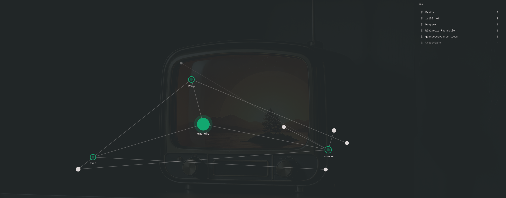
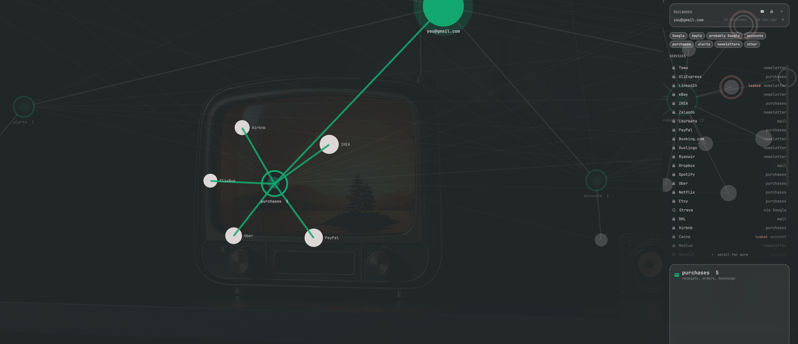

# Omabeam

Lightbeam for the whole machine, and for your inbox.


Mozilla's Lightbeam drew a web of every site you visited and every third party
those sites pulled in, and let it grow while you browsed. Omabeam is an Omarchy
bar widget that draws two pictures in that spirit:

- **Machine**: every process with a socket open, every remote host on the far
  end of one, named and attributed, accumulated for as long as you leave it
  running. Hosts on the EasyPrivacy and EasyList tracker lists wear a red ring.
- **Footprint**: every service that has your e-mail address, read from the
  mailbox itself, grouped by what it sends you and by whether you signed in
  with Google or Apple. Services found in a data breach wear a red ring.

Click the bar icon and the screen becomes the web. Press Tab to switch between
the two pictures.

## Install

```bash
omarchy pkg add libsecret wl-clipboard
omarchy plugin add https://github.com/Gabbe2312/omabeam.git --enable
```

The first line makes sure `secret-tool` (keyring) and `wl-copy` (clipboard
import) are there; on a stock Omarchy they usually are. `--enable` puts the
icon on the bar. Everything else the plugin needs ships with Omarchy: Python 3
and `ss` from iproute2. Optional: the 1Password CLI (`op`) for the login
markers, and a polkit rule for DNS names (see Trackers).

## Remove

```bash
omarchy plugin remove io.github.gabbe2312.omabeam
rm -rf ~/.config/omarchy/omabeam ~/.cache/omarchy/omabeam
secret-tool clear service io.github.gabbe2312.omabeam
sudo rm -f /etc/polkit-1/rules.d/50-omabeam-dns.rules   # only if you installed it
```

The `rm` line removes the mailbox configuration and everything that was read
from it. The `secret-tool` line removes the app passwords from the keyring.
Nothing else is written anywhere.

## Machine



- **Processes** are green rings: `chromium`, `spotify`, `ssh`. Sockets owned
  by another user (tailscaled, the DHCP client, systemd-resolved) show up as
  `system`, because `ss` only names processes you own unless you are root.
- **Internet hosts** are filled dots, grouped by who owns them: Google,
  Cloudflare, Fastly, `tailscale.com`. Where a host sits on a cloud provider's
  address space, the reverse name wins over the provider, so
  `lb.fra.tailscale.com` is Tailscale, not Amazon.
- **Local network** hosts are hollow dots and **tailnet** peers hollow with a
  centre dot. Neither is ever merged: the printer and the NAS stay separate.
- A host that just appeared pulses for a moment, one that has gone quiet fades,
  and after ten minutes of silence it drops off.
- **Hover** a dot to light up its neighbourhood and read the details:
  addresses, reverse names, ports, which processes reach it, first and last
  seen. **Click** to pin it. **Drag** to move it. **Click empty space**, or
  press Esc, to close.

### Where the names come from

- **Reverse DNS**, through the system resolver, so mDNS and your router's
  hostnames come along for free.
- **Tailscale** for tailnet peers, from `tailscale status`.
- **Owners** from Team Cymru's IP-to-ASN whois service. This is one bulk query
  per batch of new public addresses. If you would rather nothing left the
  machine, set `"owners": false` and you get reverse names only.

Names are cached in `~/.cache/omarchy/omabeam/names.json`; the session lives
beside it and survives a shell restart.

### Trackers

Every host is matched against EasyPrivacy and EasyList (the domain rules only,
fetched weekly from easylist.to, kept locally). Anything on the lists wears a
red ring and is counted at the top. That is Lightbeam's picture, for the whole
machine rather than one browser.

Reverse DNS rarely says what a host is for: a Google analytics endpoint
answers to `1e100.net`. The name the machine actually asked for does, so
Omabeam can follow systemd-resolved's query stream and name hosts by it. That
stream is a polkit-protected action, so it needs one rule installed once:

```bash
~/.config/omarchy/plugins/io.github.gabbe2312.omabeam/bin/omabeam dns-rule \
  | sudo tee /etc/polkit-1/rules.d/50-omabeam-dns.rules
omarchy restart shell
```

The rule grants your user the `org.freedesktop.resolve1.subscribe-query-results`
action and nothing else. Without it everything still works; hosts are just
named by reverse DNS and the tracker match is only as good as that name.

## Footprint



Your address sits in the middle. Around it are bubbles, and every service that
has ever written to you hangs off the bubble that fits it best. Which bubbles
you see depends on the grouping (press **g** to switch):

**By sign-in** (default): **Google** and **Apple** hold the services you
proved you signed in with; **probably Google** and **probably Apple** hold the
ones that look that way; **accounts**, **purchases**, **alerts**,
**newsletters** and **other** hold the rest by what they send.

**By mail kind**: only the five mail-kind bubbles.

- **accounts**: verified you, welcomed you, reset your password
- **purchases**: receipts, orders, bookings, renewals
- **alerts**: sign-ins, new devices, security codes
- **newsletters**: anything with an unsubscribe link and nothing else to say
- **other**: mail the word lists could not place

Filled dots have an account or bought something; hollow ones only send
newsletters. A green centre dot means you hold a login for it in 1Password.
A red ring means the address was found in a breach at that service. The chips
above the list hide and show bubbles.

**Hover** a service for the breakdown, the domains it writes from and the
breach details. **Click** a bubble to fly in on it: its members are named and
its lines are lit. Click outside to fly back out; click outside again, or
press Esc, to close.

The inbox is the most complete record there is of who has your address,
because every service wrote at least once to welcome, verify or bill you.

### Connecting a mailbox

Type the address and an **app password** into the form, not your real
password. Gmail needs 2-step verification on, then a password from
myaccount.google.com/apppasswords; iCloud makes them at appleid.apple.com.
Yahoo and plain IMAP providers work the same way. Outlook and Hotmail cannot be
read like this, because Microsoft removed password logins for IMAP. Proton
works through the Proton Bridge with `--host 127.0.0.1 --port 1143` on the
command line.

The password goes into the login keyring under `io.github.gabbe2312.omabeam`,
never into a file. Only headers are read: sender, subject, date, and whether
there is an unsubscribe link. The two exceptions are Google's own security
notices and the first mail from each sender, whose bodies are read to find
device and app names. Mail from people (a personal address at gmail, hotmail,
online.no and the like) is counted and left out. The first read goes back 36
months (`"mailMonths"` in shell.json) and takes a minute or two for a large
mailbox; after that **s** reads only what is new.

Set `"onePassword": true` to get a key button that asks the 1Password CLI
(`op item list`) which of those services you hold a login for. That needs the
1Password app unlocked with CLI integration turned on.

The `✕` on a mailbox row forgets the mailbox, its keyring entry and everything
read from it.

### Several mailboxes

Add each mailbox from the MAILBOXES card (plus button, same form). Every
mailbox becomes its own picture on the same canvas, side by side, and the view
starts zoomed out so all of them fit. Click a mailbox's centre to fly in on it;
the side panel then shows that mailbox alone. Click outside to see them all
again.

### Google and Apple

No API will tell you which sites hang off your Google or Apple account. That
list lives only on the provider's own settings page. Three things stand in
for it.

**The mailbox proves some of it.** Google writes a security notice the moment
something is granted access to the account, usually a device (Windows, iOS) or
an app with real permissions, and names it in the body. A service writing to
an `@privaterelay.appleid.com` address is there because you used Sign in with
Apple and Hide My Email; the relay address is the proof, and the panel shows
which one.

**The mailbox suggests the rest.** A service you signed up with using an
address and a password almost always sent "confirm your e-mail" or "set your
password". One you signed into with Google or Apple skipped that. So a service
that treats you as a customer (account, receipt or security mail) but never
asked you to confirm anything goes into **probably Google** or **probably
Apple**, whichever runs the mailbox, drawn lighter because it is a guess.

**You can paste the provider's own list.** Open the page from the CONNECTED
APPS card (lock button), select all, copy, and press **From clipboard**. The
parser keeps the lines that look like names and drops the page's own
furniture; a re-paste replaces that provider's list, so revoking an app and
pasting again removes it here too.

| provider  | page                                     |
|-----------|------------------------------------------|
| Google    | myaccount.google.com/connections         |
| Apple     | account.apple.com, Sign in with Apple    |
| Microsoft | account.live.com/consent/Manage          |
| Facebook  | facebook.com/settings?tab=applications   |
| GitHub    | github.com/settings/applications         |

### Leaks

Once a day the footprint asks XposedOrNot, a free breach index that needs no
key, which breaches list each connected address. With a Have I Been Pwned API
key on the widget (`"hibpKey"` in shell.json) that service is asked instead.
A service that leaked you wears a red ring; hover it for the breach, the year
and what went with it: passwords, names, locations. Breaches at services that
never wrote to you appear as their own nodes. The address is the only thing
sent.

## Keys

| key     | does                                                     |
|---------|----------------------------------------------------------|
| Esc     | leave the form, fly out, unpin, close; one step at a time |
| Tab     | switch between machine and footprint                      |
| s       | footprint: read new mail                                  |
| g       | footprint: group by sign-in or by mail kind               |
| g       | machine: one node per owner or one per address            |
| l       | machine: hide or show local network and tailnet peers     |
| r       | machine: forget the session and start over                |
| space   | freeze the layout                                         |
| + / -   | zoom (the wheel works too)                                |

Right-click the bar icon to forget the machine session without opening the
graph.

## Settings

All optional, on the widget's entry in `~/.config/omarchy/shell.json`:

```json
{
  "id": "io.github.gabbe2312.omabeam",
  "mode": "footprint",
  "groupBy": "identity",
  "mailMonths": 36,
  "onePassword": false,
  "hibpKey": "",
  "interval": 2,
  "idleInterval": 10,
  "forgetAfter": 600,
  "owners": true,
  "grouped": true,
  "showLan": true
}
```

`mode` is the picture that opens first. `groupBy` is `identity` or `kind`.
`interval` is how often the socket table is read while the graph is open,
`idleInterval` while it is closed. `forgetAfter` is how many seconds a quiet
host stays on the graph; `0` keeps everything until you press `r`.

## IPC

```bash
omarchy-shell io.github.gabbe2312.omabeam toggle
omarchy-shell io.github.gabbe2312.omabeam footprint     # open on the footprint
omarchy-shell io.github.gabbe2312.omabeam machine       # open on the machine graph
omarchy-shell io.github.gabbe2312.omabeam sync          # read new mail
omarchy-shell io.github.gabbe2312.omabeam breaches      # ask the breach index now
omarchy-shell io.github.gabbe2312.omabeam trackers      # refresh the tracker lists
omarchy-shell io.github.gabbe2312.omabeam importClipboard google
omarchy-shell io.github.gabbe2312.omabeam reset
```

## Evidence and guesses

Be clear about which is which when you read the graph:

| shown as | what it rests on |
|---|---|
| Google, Apple | Google's own "granted access" notices, a service writing to a `@privaterelay.appleid.com` address, or a list pasted from the provider's page |
| probably Google, probably Apple | a customer relationship with no "confirm your address" mail ever sent; a silent social sign-in is the likeliest explanation, not a certainty |
| accounts, purchases, alerts, newsletters | word lists matched against subject lines, in `bin/words.json` (English, Norwegian, some German); anything else is `other` |
| leaked | XposedOrNot or Have I Been Pwned lists the address in that breach |
| tracker | the host, or a parent domain, is on EasyPrivacy or EasyList |
| owner | Team Cymru's IP-to-ASN answer for the address |

Silent "Sign in with Google" on a website leaves no mail at all. If the Google
bubble looks short next to Google's own page, that is why; the pasted list is
the only complete source.

## Security

- The app password never touches a file or a command line. It goes into the
  login keyring through `secret-tool` and is handed to the helper on stdin.
- IMAP is TLS with certificate and hostname verification.
- What is written to disk is sender domains, names, dates and counts, in files
  readable by your user only. No mail body is stored.
- What leaves the machine, and to whom: your IMAP server (to read headers),
  XposedOrNot or Have I Been Pwned (the address, once a day), Team Cymru
  (remote IP addresses, for owner names; `"owners": false` stops it),
  easylist.to (a list download, weekly). Nothing else.
- Every answer from the network is read under a byte cap, so a broken or
  hostile server cannot fill memory. Mail is fetched with IMAP byte ranges:
  8 KB of headers per message in batches of 200, 40 KB per body in batches
  of 20, and the connection is dropped if the server sends a literal above
  64 KB or a single answer above 4 MB. Whois answers stop at 1 MB, tracker
  lists at 16 MB, breach lookups at 4 MB.
- No sudo is needed. The optional polkit rule for DNS names is printed for you
  to read and install yourself.

## What it cannot show

Nobody can see where Google sends your data once it has it; that was never
observable, not for Lightbeam either. What can be seen is who has your address,
which of them you reach through Google or Apple, and who this machine talks to.

Only established TCP and connected UDP sockets appear, so a single DNS query
or a one-shot HTTP request that finished between two readings is missed. It
sees which host a process talks to, not which site: a browser tab on a
Cloudflare-fronted site shows as Cloudflare. Lightbeam had the browser's view;
this has the kernel's.

## Developing

Edit in a checkout, copy into the plugin directory, restart the shell. QML is
not reloaded on the fly. The classifier and parsers are covered by tests; run
them after editing `bin/words.json` or the mail helper:

```bash
python3 -m unittest discover tests
```

## License

MIT.
